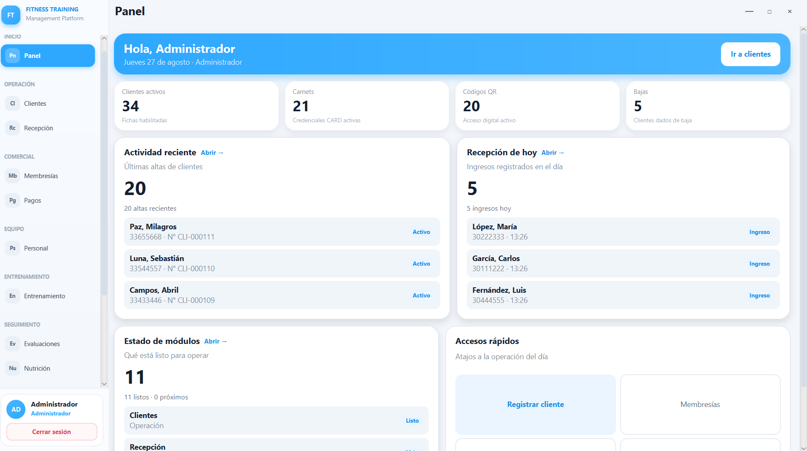
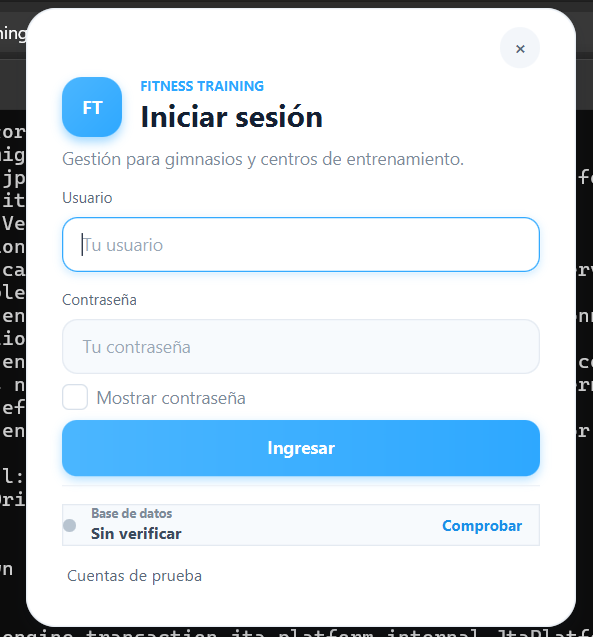
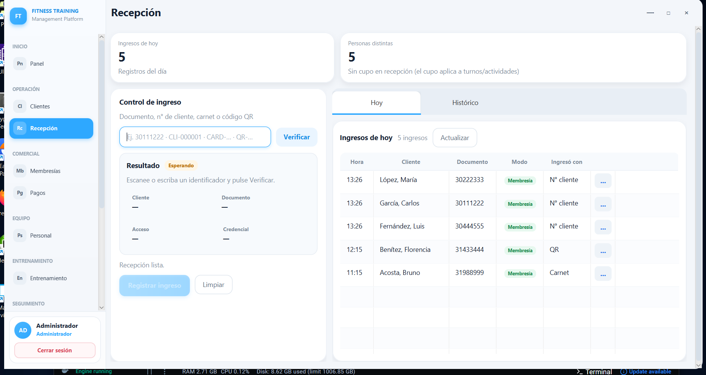
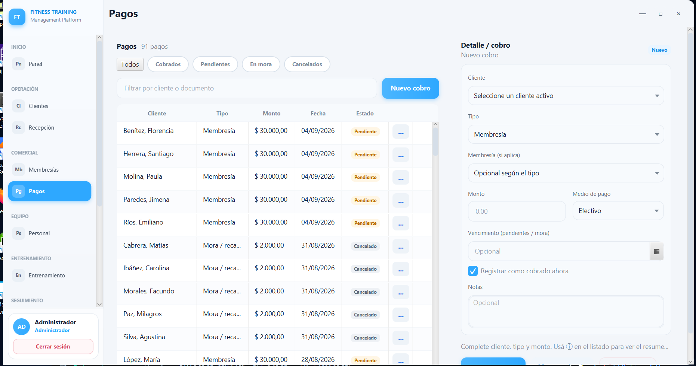
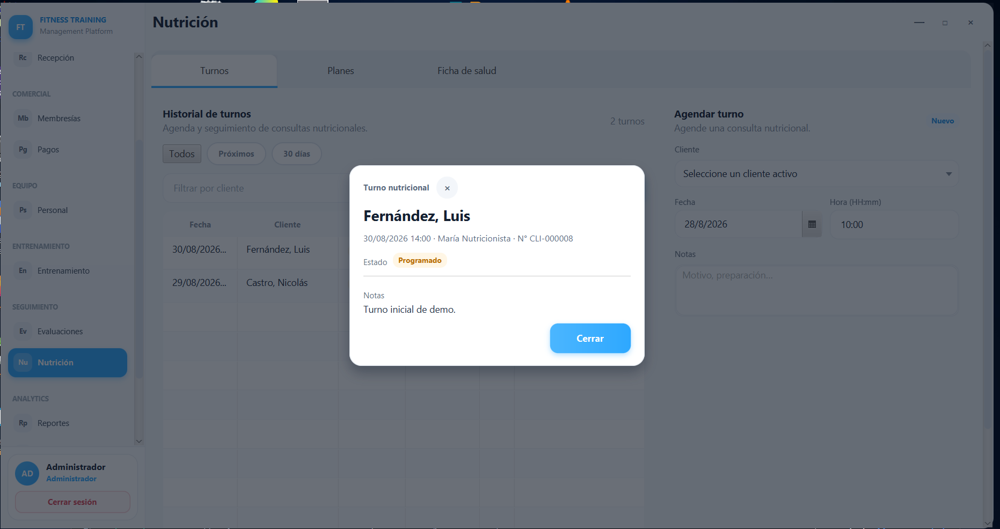
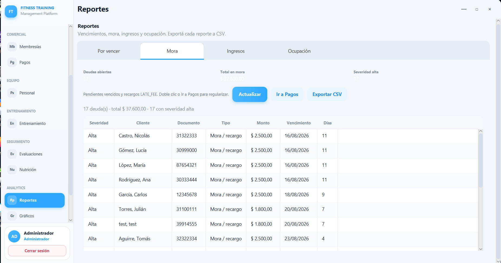
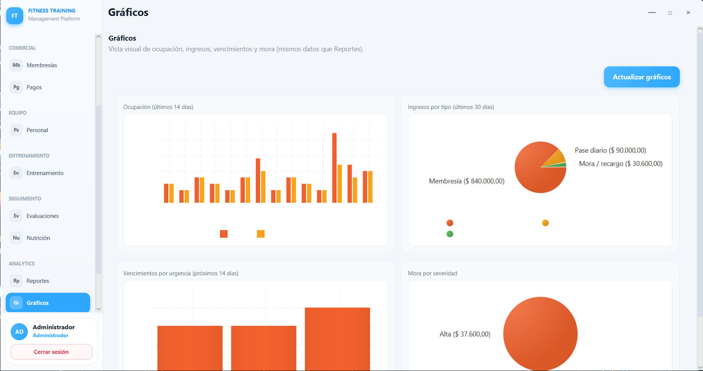

[](https://openjdk.org/)
[](https://openjfx.io/)
[](https://www.postgresql.org/)
[](https://maven.apache.org/)
[](https://flywaydb.org/)
[](https://www.docker.com/)
[](./LICENSE)

# Fitness Training Management Platform 

Aplicación de escritorio para **centros de entrenamiento y gimnasios**: clientes, membresías, pagos, recepción (check-in), personal, entrenamiento, evaluaciones, nutrición y **analytics** (reportes tabulares y gráficos). Implementada con **Java 21**, **JavaFX**, **PostgreSQL 16**, **Flyway**, **Maven** y despliegue portable o con instalador para Windows.

* [¿Qué ejecutar? (entrega al cliente)](./install/QUE-EJECUTAR.md) — **empezar aquí si empaquetás el zip**
* [Documentación](./docs/README.md) — capturas y especificación funcional
* [Instalación en cliente](./install/CLIENTE.md)
* [Instalación para desarrollo](./install/DESARROLLO.md)
* [Especificación funcional](./docs/especificacion-funcional.md)

---

## Entrega al gimnasio (proveedor)

**Vos** generás el zip. El **gimnasio** solo descomprime y usa `Iniciar.bat`.

```bat
package-full.bat
```

Eso descarga Java + PostgreSQL portable (si faltan), compila la app y crea:

`target\FitnessTraining-client-win64.zip` → **ese archivo se entrega al cliente**.

| Script | Quién | Uso |
|--------|-------|-----|
| `package-full.bat` | Desarrollador | Zip completo para el gimnasio |
| `run.bat` | Desarrollador | Probar cambios en tu PC |
| `Iniciar.bat` | Cliente | Dentro del zip descomprimido |

Detalle: [install/QUE-EJECUTAR.md](./install/QUE-EJECUTAR.md)

---

`Última actualización: 27/08/2026`

### Sección 1) Descripción, configuración y tecnologías

* [1.0) Descripción del proyecto](#10-descripción-del-proyecto-)
* [1.1) Ejecución del proyecto](#11-ejecución-del-proyecto-)
* [1.2) Configuración desde cero](#12-configuración-desde-cero-)
* [1.3) Base de datos (Docker / PostgreSQL)](#13-base-de-datos-docker--postgresql-)
* [1.4) Tecnologías](#14-tecnologías-)
* [1.5) Módulos disponibles](#15-módulos-disponibles-)

### Sección 2) Pruebas

* [2.0) Resumen de pruebas](#20-resumen-de-pruebas-)
* [2.1) Comandos](#21-comandos-)
* [2.2) Cobertura y tipos](#22-cobertura-y-tipos-)

### Sección 3) Capturas de la aplicación

* [3.0) Galería de pantallas](#30-galería-de-pantallas-)

### Sección 4) Referencias y entrega

* [4.0) Cuentas demo](#40-cuentas-demo-)
* [4.1) Estructura del repositorio](#41-estructura-del-repositorio-)
* [4.2) Referencias](#42-referencias-)

---

## Sección 1) Descripción, configuración y tecnologías

### 1.0) Descripción del proyecto [🔝](#index-)

#### 1.0.0) Descripción general

**Fitness Training Management Platform** es una aplicación **de escritorio (Windows)** para la operación diaria de un centro de entrenamiento. Centraliza la gestión de clientes y credenciales (carnet y QR), membresías y vencimientos, cobros y mora, control de acceso en recepción, staff interno, rutinas y ejercicios, evaluaciones físicas, nutrición y reportes de gestión.

**Características principales:**

- **Multi-rol:** administrador, recepción, entrenador y nutricionista con menú filtrado por permisos
- **Clientes y credenciales:** alta/edición, baja lógica, carnet con vencimiento, QR para check-in
- **Membresías y pagos:** planes, cobros, mora, reactivación de acceso
- **Recepción:** check-in por carnet/QR, histórico, bloqueo por deuda
- **Entrenamiento y evaluaciones:** ejercicios, rutinas e historial de evaluaciones
- **Nutrición:** turnos, planes y ficha de salud
- **Analytics:** reportes (vencimientos, mora, ingresos, ocupación) con exportación CSV para Excel y gráficos JavaFX
- **Instalación guiada:** primera conexión a PostgreSQL, migraciones Flyway y paquete portable para el cliente

**Usuarios objetivo:**

- Dueños y administradores de gimnasios / centros de entrenamiento
- Personal de recepción y mostrador
- Entrenadores y nutricionistas del staff
- Proveedores que despliegan la solución en la PC del cliente

#### 1.0.1) Arquitectura y operación

La aplicación sigue una **arquitectura por capas** con módulos de dominio y una shell JavaFX común:

```
┌─────────────────────────────────────────────────────────────┐
│                    Presentación (JavaFX)                    │
│  ┌──────────────┐  ┌──────────────┐  ┌────────────────────┐ │
│  │  Shell / Nav │  │  FXML Views  │  │  Controllers       │ │
│  └──────────────┘  └──────────────┘  └────────────────────┘ │
└─────────────────────────────────────────────────────────────┘
┌─────────────────────────────────────────────────────────────┐
│                    Lógica de negocio                        │
│  ┌──────────────┐  ┌──────────────┐  ┌────────────────────┐ │
│  │   Services   │  │   DTOs       │  │  Seeders / Export  │ │
│  └──────────────┘  └──────────────┘  └────────────────────┘ │
└─────────────────────────────────────────────────────────────┘
┌─────────────────────────────────────────────────────────────┐
│                    Acceso a datos                           │
│  ┌──────────────┐  ┌──────────────┐  ┌────────────────────┐ │
│  │ Repositories │  │   JDBC       │  │  PostgreSQL 16     │ │
│  └──────────────┘  └──────────────┘  └────────────────────┘ │
└─────────────────────────────────────────────────────────────┘
```

**Flujo típico:**

1. Login con usuario/contraseña (BCrypt) y sesión por rol
2. Navegación lateral según permisos (`NavigationCatalog`)
3. Pantallas FXML + controladores por módulo
4. Servicios de dominio y repositorios JDBC
5. Persistencia en PostgreSQL con esquema versionado por **Flyway**

**Fuera de alcance en esta etapa:** liquidación de haberes y asistencia de profesores (ver [especificación funcional](./docs/especificacion-funcional.md)).

---

### 1.1) Ejecución del proyecto [🔝](#index-)

#### Requisitos previos

| Requisito | Detalle |
|-----------|---------|
| **Java** | JDK 21 ([Adoptium](https://adoptium.net/) u OpenJDK) |
| **Maven** | 3.9+ |
| **Docker** (opción recomendada) | Docker Desktop para PostgreSQL local |
| **PostgreSQL** (alternativa) | 16 instalado en Windows sin Docker |
| **SO** | Windows 10/11 (64 bits) |

#### Inicio rápido (desarrollo)

```bat
# 1. Base de datos con Docker
docker compose up -d

# 2. Compilar y ejecutar
mvn javafx:run
```

O usar el script de desarrollo:

```bat
run.bat
```

La primera ejecución puede abrir **Configurar conexión** si no existe `.env` o la base no responde. Valores por defecto en [.env.example](./.env.example).

---

### 1.2) Configuración desde cero [🔝](#index-)

#### Paso 1: Clonar el repositorio

```bat
git clone <url-del-repositorio>
cd Fitness_Training_Management_Platform-Desktop
```

#### Paso 2: Variables de entorno

```bat
copy .env.example .env
```

Editar `.env` con puerto, nombre de base, usuario y contraseña de PostgreSQL.

#### Paso 3: Base de datos y migraciones

Con Docker:

```bat
docker compose up -d
```

Flyway se ejecuta al iniciar la aplicación (o con el perfil Maven correspondiente en desarrollo).

#### Paso 4: Datos demo (opcional)

Al arrancar en modo desarrollo se pueden cargar usuarios, clientes, membresías, pagos y datos de analytics de demostración (seeders en `com.fitnesstraining.bootstrap`).

#### Paso 5: Ejecutar la aplicación

```bat
mvn javafx:run
```

---

### 1.3) Base de datos (Docker / PostgreSQL) [🔝](#index-)

| Variable | Descripción | Ejemplo |
|----------|-------------|---------|
| `POSTGRES_PORT` | Puerto PostgreSQL | `5432` |
| `POSTGRES_DB` | Nombre de la base | `fitness_training` |
| `POSTGRES_USER` | Usuario | `postgres` |
| `POSTGRES_PASSWORD` | Contraseña | *(cambiar en producción)* |

`docker-compose.yml` levanta PostgreSQL 16 con volumen persistente. Detalle de instalación en PC del cliente: [install/CLIENTE.md](./install/CLIENTE.md).

---

### 1.4) Tecnologías [🔝](#index-)

| Área | Tecnología |
|------|------------|
| Runtime | Java 21 |
| UI | JavaFX 21, FXML |
| Build | Maven |
| Base de datos | PostgreSQL 16 |
| Migraciones | Flyway |
| Seguridad | BCrypt (contraseñas) |
| Contenedor DB | Docker Compose |
| Exportación | CSV (Windows-1252, compatible Excel) |
| Pruebas | JUnit 5, Mockito |
| Despliegue cliente | Scripts `package.bat`, carpeta portable, `Iniciar.bat` |

---

### 1.5) Módulos disponibles [🔝](#index-)

| Módulo | Descripción | Rol típico |
|--------|-------------|------------|
| **Panel** | KPIs: clientes activos, carnets, QR, bajas | Todos (según permiso) |
| **Clientes** | Ficha, listado, filtros, baja lógica, carnet, QR | Admin, Recepción |
| **Membresías** | Planes, altas, vencimientos | Admin, Recepción |
| **Pagos** | Cobros, mora, reactivación | Admin, Recepción |
| **Recepción** | Check-in carnet/QR, histórico | Recepción |
| **Personal** | ABM usuarios internos y roles | Admin |
| **Entrenamiento** | Ejercicios y rutinas | Admin, Entrenador |
| **Evaluaciones** | Historial de evaluaciones físicas | Admin, Entrenador |
| **Nutrición** | Turnos, planes, ficha de salud | Admin, Nutricionista |
| **Analytics — Reportes** | Vencimientos, mora, ingresos, ocupación + CSV | Admin |
| **Analytics — Gráficos** | Charts JavaFX de los mismos indicadores | Admin |

Estado detallado de requerimientos (RF) y casos de uso: [docs/especificacion-funcional.md](./docs/especificacion-funcional.md).

---

## Sección 2) Pruebas

### 2.0) Resumen de pruebas [🔝](#index-)

El proyecto incluye pruebas unitarias y de servicio en `src/test/java`, con foco en lógica de negocio, exportación CSV y analytics.

### 2.1) Comandos [🔝](#index-)

```bat
# Todas las pruebas
mvn test

# Una clase
mvn test -Dtest=CsvExporterTest

# Compilar sin ejecutar
mvn compile
```

### 2.2) Cobertura y tipos [🔝](#index-)

| Tipo | Ubicación | Ejemplos |
|------|-----------|----------|
| Unitarias | `src/test/java` | `CsvExporterTest`, servicios de dominio |
| Integración ligera | Servicios + repositorios con DB de test | Según perfil Maven / testcontainers si está configurado |

---

## Sección 3) Capturas de la aplicación

### 3.0) Galería de pantallas [🔝](#index-)

Capturas actualizadas al **27/08/2026**. Más detalle en [docs/README.md](./docs/README.md).

| Panel | Login | Recepción |
|:---:|:---:|:---:|
|  |  |  |

| Pagos | Nutrición | Analytics — Reportes |
|:---:|:---:|:---:|
|  |  |  |

| Analytics — Gráficos |
|:---:|
|  |

Para reemplazar imágenes: agrega archivos en `docs/img/` con nombre descriptivo y actualiza `docs/assets/app-hero.png` si cambia el banner principal.

---

## Sección 4) Referencias y entrega

### 4.0) Cuentas demo [🔝](#index-)

Disponibles cuando los seeders de desarrollo están activos:

| Usuario | Contraseña | Rol |
|---------|------------|-----|
| `admin` | `1234` | Administrador |
| `empleado1` | `emp123` | Recepción |
| `juan_prof` | `prof123` | Entrenador |
| `maria_nutri` | `nutri123` | Nutricionista |

**No usar estas credenciales en producción.**

### 4.1) Estructura del repositorio [🔝](#index-)

```
├── docs/                    # Especificación, capturas, assets del README
│   ├── assets/              # app-hero.png, badges
│   ├── img/                 # Capturas por módulo (nombre descriptivo)
│   └── especificacion-funcional.md
├── install/                 # Guías CLIENTE y DESARROLLO
├── src/main/java/           # Código Java (módulos por paquete)
├── src/main/resources/      # FXML, estilos, migraciones Flyway
├── docker-compose.yml
├── package.bat              # Genera entrega para cliente
└── pom.xml
```

### 4.2) Referencias [🔝](#index-)

| Recurso | Enlace |
|---------|--------|
| Documentación de capturas | [docs/README.md](./docs/README.md) |
| Especificación funcional | [docs/especificacion-funcional.md](./docs/especificacion-funcional.md) |
| Instalación cliente | [install/CLIENTE.md](./install/CLIENTE.md) |
| Instalación desarrollo | [install/DESARROLLO.md](./install/DESARROLLO.md) |
| Ejemplo de README (estructura) | [ApiRest_Electronic_Devices_ExpressJS](https://github.com/andresWeitzel/ApiRest_Electronic_Devices_ExpressJS) |
| Referencia Club Deportivo (C#) | `DSOO_ClubDeportivo_ref` (módulo Reportes) |

---

## Licencia

GPL-3.0 — ver [LICENSE](./LICENSE).
