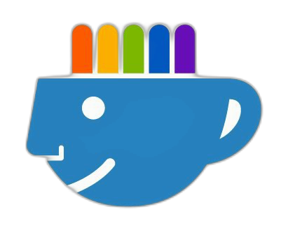

<div align="center">

<div align="right">
  
  
  
  
  
</div>
</div>

<br>

<br>

<div align="right">
  <a href="./translations/README.es.md" title="Español">
    
  </a>
  <a href="./README.md" title="English">
    
  </a>
</div>

<div align="center">

# Fitness Training Management Platform 

</div>

Fitness Training Management Platform es el sistema de escritorio para gimnasios y centros de entrenamiento que necesitan operar el día a día sin perder tiempo: clientes, membresías, pagos, recepción con check-in, personal, entrenamiento, evaluaciones, nutrición y analytics en una sola aplicación Windows.

En Recepción el ingreso es inmediato: documento, carnet, QR o número de cliente, con control de mora y registro del día. El Panel y Analytics muestran mora, ingresos y ocupación; los roles (admin, recepción, entrenador, nutricionista) ven solo lo que necesitan. Pensada para una PC en el mostrador o varias estaciones contra el mismo PostgreSQL (Docker, servicio local o servidor en red).

Qué incluye

* Recepción: check-in rápido, histórico del día y bloqueo por mora.
* Clientes y membresías: credenciales, carnet/QR, planes y vencimientos.
* Pagos: cobros, listados y seguimiento de deuda.
* Entrenamiento y nutrición: turnos, planes y evaluaciones por rol.
* Analytics: reportes y gráficos para decisiones del negocio.
* Despliegue: zip para el gimnasio con `Iniciar.bat`.

<br>

## Index 📜

<details>
  <summary>Ver detalle</summary>

<div align="right">

`Última actualización: 31/08/26`

</div>

### Sección 1) Descripción, ejecución y configuración

* [1.0) Descripción del proyecto](#10-descripción-del-proyecto-)
* [1.1) Ejecución del proyecto](#11-ejecución-del-proyecto-)
* [1.2) Configuración desde cero](#12-configuración-desde-cero-)
* [1.3) Base de datos (Docker y PostgreSQL)](#13-base-de-datos-docker-y-postgresql-)
* [1.4) Tecnologías y módulos](#14-tecnologías-y-módulos-)

### Sección 2) Pruebas

* [2.0) Pruebas](#20-pruebas-)

### Sección 3) Capturas

* [3.0) Galería de pantallas](#30-galería-de-pantallas-)

### Sección 4) Referencias y entrega

* [4.0) Cuentas demo](#40-cuentas-demo-)
* [4.1) Estructura del repositorio](#41-estructura-del-repositorio-)
* [4.2) Documentación](#42-documentación-)
* [4.3) Entrega al gimnasio](#43-entrega-al-gimnasio-)
* [4.4) Pruebas funcionales (YouTube)](#44-pruebas-funcionales-youtube-)
* [4.5) Licencia](#45-licencia-)

<br>

</details>

<br>

## Sección 1) Descripción, ejecución y configuración

### 1.0) Descripción del proyecto [🔝](#index-)

<details>
  <summary>Ver detalle</summary>
  <br>

Fitness Training Management Platform es una aplicación de escritorio (Windows) para la operación diaria de un centro de entrenamiento: clientes y credenciales (carnet, QR), membresías, pagos, recepción, personal, entrenamiento, evaluaciones, nutrición y analytics (reportes + gráficos).

Características: multi-rol (admin, recepción, entrenador, nutricionista), check-in con bloqueo por mora, exportación CSV para Excel, conexión a PostgreSQL (Docker, sistema o red) y migraciones Flyway.

Fuera de alcance en esta etapa: liquidación de haberes y asistencia de profesores ([especificación funcional](./docs/especificacion-funcional.md)).

Arquitectura por capas: JavaFX (FXML) → servicios de dominio → JDBC → PostgreSQL 16.

<br>

</details>

### 1.1) Ejecución del proyecto [🔝](#index-)

<details>
  <summary>Ver detalle</summary>
  <br>

Mapa completo: [scripts/README.md](./scripts/README.md) · [¿Qué ejecutar?](./install/QUE-EJECUTAR.md)

<br>

### Cliente (gimnasio)

Descomprimir el zip y ejecutar:

```bat
Iniciar.bat
```

| Acción | Comando |
|--------|---------|
| Instalar y abrir todo (recomendado) | `Iniciar.bat` |
| Solo la aplicación | `app\FitnessTraining.bat` |
| Levantar base (Docker, manual) | `scripts\db\start-db.bat` |
| Detener base (Docker, manual) | `scripts\db\stop-db.bat` |
| Respaldo de la base | `scripts\db\backup-db.bat` |

**`Iniciar.bat` es el launcher del cliente** — el único script que el gimnasio debe usar en el día a día. Ejecuta en orden los scripts de `scripts\setup\`, `scripts\java\`, `scripts\docker\` y `scripts\db\`, y abre la aplicación. No hace falta ejecutar esos `.bat` por separado; los de la tabla (excepto `Iniciar.bat`) son solo para casos puntuales.

Al ejecutar `Iniciar.bat`:

1. Primera vez: configuración local (`scripts\setup\`).
2. Verifica Java 21; si falta, ofrece instalarlo con winget.
3. Verifica Docker (opcional); si falta, ofrece instalarlo con winget.
4. Si hay Docker, levanta PostgreSQL (`scripts\db\`).
5. Abre la app (`app\FitnessTraining.bat`); Flyway migra al conectar.

Primera instalación con Docker: editar `db\.env` (`POSTGRES_PASSWORD`) antes de `Iniciar.bat`. Sin Docker, PostgreSQL del sistema debe estar activo.

Si algo falla: Java → volver a `Iniciar.bat` o instalar Java 21; `Connection refused` → Docker/PostgreSQL activo; puerto 5432 ocupado → usar solo Docker o solo PostgreSQL del sistema.

Más detalle: [CLIENTE.md](./install/CLIENTE.md) · [CONFIGURAR-JAVA-POSTGRES.md](./install/CONFIGURAR-JAVA-POSTGRES.md)

<br>

---

<br>

### Desarrollador — repositorio

| Acción | Comando |
|--------|---------|
| Levantar base (Docker) | `scripts\dev\db\start-db.bat` |
| Compilar y abrir la app | `scripts\dev\app\run.bat` |
| Generar zip para el gimnasio | `scripts\dev\build\package.bat` |
| Probar launcher del cliente | `scripts\dev\client\start-client-dist.bat` |
| Solo app empaquetada | `scripts\dev\app\start-app-packaged.bat` |
| Detener base (Docker) | `scripts\dev\db\stop-db.bat` |

Abrir Docker Desktop (Engine en ejecución) antes de levantar la base.

**Paso 1 — Variables de entorno**

```bat
copy .env.example .env
```

**Paso 2 — Base de datos**

| Opción | Comando |
|--------|---------|
| Script (recomendado) | `scripts\dev\db\start-db.bat` |
| Manual | `docker compose up -d` |

Verificar: `docker compose ps` — contenedor PostgreSQL en estado running.

**Paso 3 — Ejecutar la aplicación**

```bat
scripts\dev\app\run.bat
```

`scripts\dev\app\run.bat` hace `mvn clean compile javafx:run`. No genera el zip del cliente.

**Paso 4 — Verificar**

1. Se abre la ventana de login.
2. Si no hay conexión válida, aparece Configurar conexión (usar valores de `.env`).
3. Entrar con `admin` / `1234` (cuentas demo en [4.0](#40-cuentas-demo-)).

**Generar entrega (opcional):**

```bat
scripts\dev\build\package.bat
```

Salida: `target\client-dist\` y `target\FitnessTraining-client-win64.zip`.

**Probar la entrega como el gimnasio (launcher completo):**

```bat
scripts\dev\client\start-client-dist.bat
```

Equivale a `target\client-dist\Iniciar.bat` (Java, Docker, base y app).

**Solo la app empaquetada (sin launcher):**

```bat
scripts\dev\app\start-app-packaged.bat
```

Si algo falla:

* Docker no encontrado → instalar Docker Desktop.
* `Connection refused` → `scripts\dev\db\start-db.bat` o revisar `.env`.
* Puerto 5432 ocupado → detener otro PostgreSQL o cambiar puerto en `.env`.

Más detalle: [DESARROLLO.md](./install/DESARROLLO.md)

<br>

</details>

### 1.2) Configuración desde cero [🔝](#index-)

<details>
  <summary>Ver detalle</summary>
  <br>

#### Prerrequisitos

| Requisito | Detalle |
|-----------|---------|
| Windows | 10/11 (64 bits) |
| JDK | 21 — [Adoptium](https://adoptium.net/) |
| Maven | 3.9+ |
| Docker Desktop | Recomendado para PostgreSQL local |
| Git | Para clonar el repositorio |

#### Clonar y preparar el proyecto

```bat
git clone <url-del-repositorio>
cd Fitness_Training_Management_Platform-Desktop
copy .env.example .env
```

#### Variables en `.env`

| Variable | Uso |
|----------|-----|
| `POSTGRES_PORT` | Puerto (por defecto `5432`) |
| `POSTGRES_DB` | Base (`fitness_training`) |
| `POSTGRES_USER` | Usuario PostgreSQL |
| `POSTGRES_PASSWORD` | Contraseña |

Flyway corre al iniciar la app. En desarrollo se cargan datos demo (seeders).

Guía extendida: [DESARROLLO.md](./install/DESARROLLO.md)

<br>

</details>

### 1.3) Base de datos (Docker y PostgreSQL) [🔝](#index-)

<details>
  <summary>Ver detalle</summary>
  <br>

La app conecta por JDBC. PostgreSQL puede estar en **Docker**, como **servicio Windows** o en **otra PC** de la red.

| Modo | Docker | Ejecución típica |
|------|--------|------------------|
| Docker en esta PC | Sí | `scripts\dev\db\start-db.bat` o `target\client-dist\Iniciar.bat` (tras empaquetar) |
| PostgreSQL del sistema | No | Servicio Windows activo + `scripts\dev\app\run.bat` |
| Servidor en red | No | `FitnessTraining.bat` con IP del servidor |

**Docker (desarrollo):**

```bat
scripts\dev\db\start-db.bat
docker compose ps
scripts\dev\db\stop-db.bat
```

**Cliente con Docker:** `Iniciar.bat` levanta el contenedor automáticamente.

Guía completa (winget, instalación manual, red): [CONFIGURAR-JAVA-POSTGRES.md](./install/CONFIGURAR-JAVA-POSTGRES.md)

<br>

</details>

### 1.4) Tecnologías y módulos [🔝](#index-)

<details>
  <summary>Ver detalle</summary>
  <br>

| Área | Tecnología |
|------|------------|
| Runtime / UI | Java 21, JavaFX 21, FXML |
| Build | Maven |
| Base de datos | PostgreSQL 16, Flyway |
| Seguridad | BCrypt |
| Contenedor DB | Docker Compose (opcional) |
| Pruebas | JUnit 5, Mockito |

| Módulo | Rol típico |
|--------|------------|
| Panel, Clientes, Membresías, Pagos | Admin, Recepción |
| Recepción (check-in) | Recepción |
| Personal | Admin |
| Entrenamiento, Evaluaciones | Admin, Entrenador |
| Nutrición | Admin, Nutricionista |
| Analytics (reportes y gráficos) | Admin |

<br>

</details>

<br>

## Sección 2) Pruebas

### 2.0) Pruebas [🔝](#index-)

Pruebas en `src/test/java` (lógica de negocio, CSV, analytics).

```bat
mvn test
mvn test -Dtest=CsvExporterTest
mvn compile
```

<br>

## Sección 3) Capturas

### 3.0) Galería de pantallas [🔝](#index-)

<details>
  <summary>Ver detalle</summary>
  <br>

Capturas: 27/08/2026 — [docs/README.md](./docs/README.md)

| Panel | Login | Recepción |
|:---:|:---:|:---:|
|  |  |  |

| Pagos | Nutrición | Analytics — Reportes |
|:---:|:---:|:---:|
|  |  |  |

| Analytics — Gráficos |
|:---:|
|  |

<br>

</details>

<br>

## Sección 4) Referencias y entrega

### 4.0) Cuentas demo [🔝](#index-)

Con seeders de desarrollo activos (no usar en producción):

| Usuario | Contraseña | Rol |
|---------|------------|-----|
| `admin` | `1234` | Administrador |
| `empleado1` | `emp123` | Recepción |
| `juan_prof` | `prof123` | Entrenador |
| `maria_nutri` | `nutri123` | Nutricionista |

### 4.1) Estructura del repositorio [🔝](#index-)

```
├── docs/           # Especificación, capturas, assets
├── src/            # Código, FXML, migraciones Flyway
├── scripts/
│   ├── dev/        # Desarrollo: run, package, start-db...
│   └── client/     # Scripts del zip para el gimnasio
├── install/        # Guías y plantillas (Iniciar.bat)
└── docker-compose.yml
```

### 4.2) Documentación [🔝](#index-)

* [Índice instalación](./install/README.md)
* [¿Qué ejecutar?](./install/QUE-EJECUTAR.md)
* [Mapa de scripts](./scripts/README.md)
* [Capturas y assets](./docs/README.md)
* [Instalación cliente](./install/CLIENTE.md)
* [Configurar Java y PostgreSQL](./install/CONFIGURAR-JAVA-POSTGRES.md)
* [Desarrollo](./install/DESARROLLO.md)
* [Especificación funcional](./docs/especificacion-funcional.md)
* [README de referencia (estructura)](https://github.com/andresWeitzel/ApiRest_Electronic_Devices_ExpressJS)

### 4.3) Entrega al gimnasio [🔝](#index-)

| Script | Quién | Qué hace |
|--------|-------|----------|
| `scripts\dev\app\run.bat` | Desarrollador | Compila y ejecuta la app (Maven). No genera zip. |
| `scripts\dev\build\package.bat` | Desarrollador | Crea `target\FitnessTraining-client-win64.zip` |
| `Iniciar.bat` | Cliente | Launcher único: ejecuta setup, Java, Docker, DB y abre la app |

El zip no incluye Java ni PostgreSQL. `Iniciar.bat` puede ofrecer instalarlos con winget — [CONFIGURAR-JAVA-POSTGRES.md](./install/CONFIGURAR-JAVA-POSTGRES.md).

Conexión a la base: Docker (opcional), PostgreSQL local o servidor en red — [CLIENTE.md](./install/CLIENTE.md).

### 4.4) Pruebas funcionales (YouTube) [🔝](#index-)

Playlist de pruebas funcionales (próximamente).

<!-- Agregar enlace cuando esté publicado:
* [Playlist YouTube](https://www.youtube.com/...) 
-->

### 4.5) Licencia [🔝](#index-)

GPL-3.0 — ver [LICENSE](./LICENSE).

<br>
